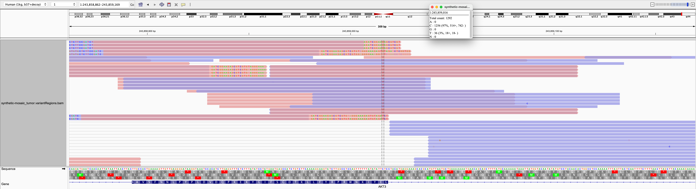

README for syntheticMosaic

This is a repo for documentating the synthetic mosaic human DNA sample

Creation and characterisation using ddPCR:
- description from README: [Word document describing creation](010_sampleCreation/syntheticMosaic_README.docx)
- data on oligos and assays: excel spreadsheet [Documentation of oligos and assays used](010_sampleCreation/variants_oligos_synthetic_sample_v1b4.xlsx)
- truth VCF file

WES of sample:
- BAM file at the relevant exons. The BAM file with the 21 positions is only 4.1 MB so should be no problem to place this in the repo. [The BAM file](020_sampleWholeExomeSeq/synthetic-mosaic_tumor.variantRegions.bam)
- Show that the oligos with mutations produce reads in a similar way to WT DNA (IGV screenshot)

- Show that the BAM VAF roughly match the ddPCR VAF. It will be interesting to see whether ampliconSeq or WES obtain the best VAF estimate. A better match between ddPCR and ampliconSeq could be due to the fact that both use amplicon based measurements.

AmpliconSeq of sample:
- awaiting the second sequencing and Asbjørn analysis.
