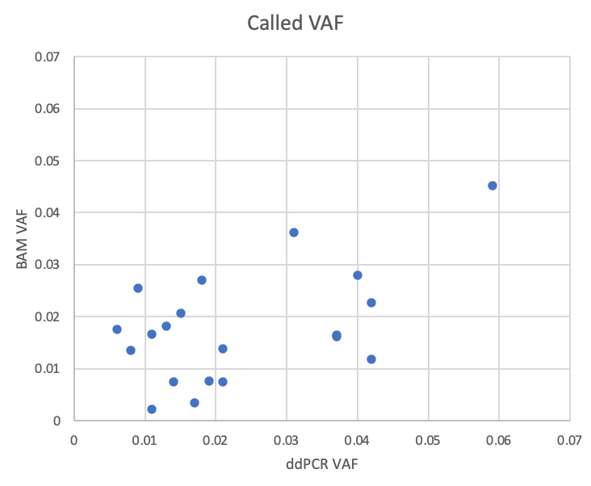

  

We create a synthetic mosaic human DNA sample by spiking 20 500bp oligos with known pathogenic variants into a WT human DNA background. The oligos are spiked in at low concentrations relative to WT DNA to emulate low grade mosaicism. The concentration also vary between oligos, so that the allele frequency of variants varies between approximately 0.5 and 6 percent. The primary purpose of this sample is to serve as a positive control for pathogenic mosaic variant detection by high throughput sequencing:
- Most variants are placed in MTOR and PIK3CA. We characterise mosaic variant allele frequencies (VAF) in the final sample by ddPCR.
- We sequenced this sample by whole exome capture and by ampliconSeq (amplification of the regions bearing mosaic variants)

### Sample creation and characterisation using ddPCR

- [Word document describing creation of the synthetic DNA sample](010_sampleCreation/syntheticMosaic_README.docx). This document covers: sample naming, creation protocol, VAF verification, possible application of this sample)
- [Excel spreadsheet documenting oligos and ddPCR assays used](010_sampleCreation/variants_oligos_synthetic_sample_v1b4.xlsx)
- [Truth VCF file](010_sampleCreation/mosaic-v01b04_truthVAF.vcf): 20 variants and their ddPCR measured variant allele frequency (VAF) in the final sample.

### Whole Exome Sequencing (Agilent + Illumina) of sample

We performed DNA capture using a whole exome kit and Illumina sequencing of the library
- [BAM file](020_sampleWholeExomeSeq/synthetic-mosaic_tumor.variantRegions.bam) at the relevant exons is available for inspection in IGV (b37 with decoy reference genome) 
- The oligos with mutations are covered with sequencing reads in a similar way to WT DNA (IGV screenshots for [AKT3](020_sampleWholeExomeSeq/IGV_screenshots/AKT3.png), [CACNA1D](020_sampleWholeExomeSeq/IGV_screenshots/CACNA1D.png),[PIK3CA](020_sampleWholeExomeSeq/IGV_screenshots/PIK3CA.png))
- All mosaic variants are represented in the sequencing data and we obtain decent correlation between ddPCR-VAF in the sample and BAM-VAF

### AmpliconSeq of sample

Awaiting the second sequencing and Asbjørn analysis.

How does ampliconSeq compare to WES on VAF accuracy? A better match between ddPCR and ampliconSeq could be due to the fact that both use amplicon based measurements.